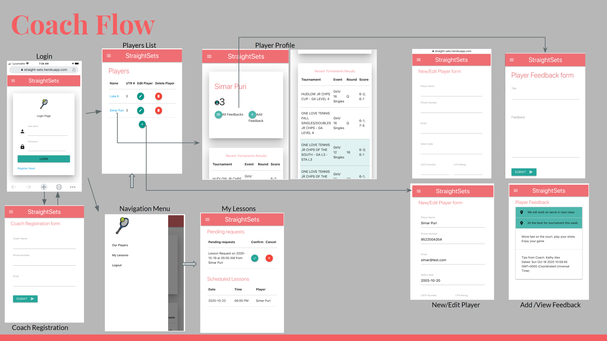
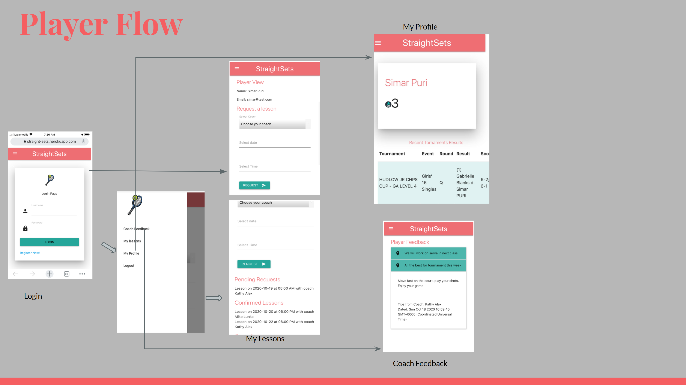
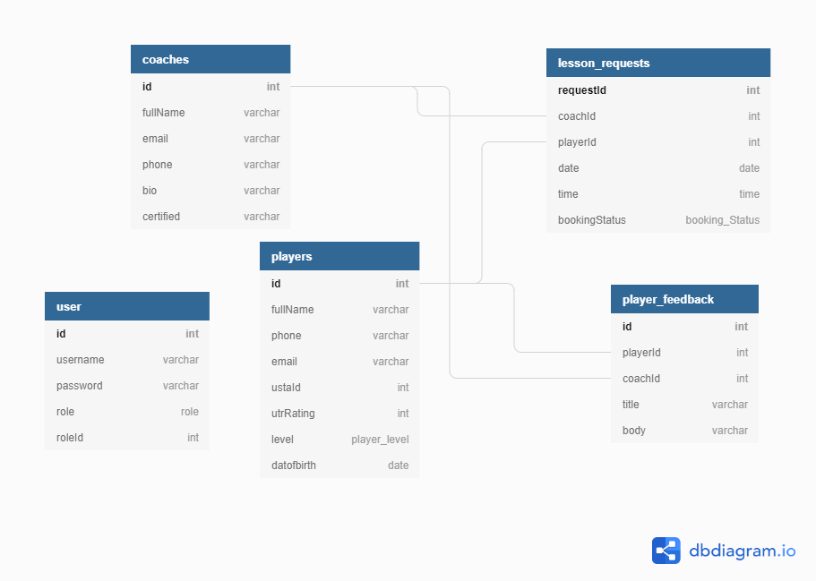

# Straight-Sets

## The Repository

The link to the website repository: [Website Repo link](https://github.com/NavdeepDP/Straight-Sets)

The link to deployed website [Website Link](https://straight-sets.herokuapp.com/)

## Development Environment using 
- Code is developed in VS code Studio using  MySQL, Node, Express, Handlebars and Sequelize ORM.

## Website Functionality/flow

### User Story
#### I as tennis coach want to... 
- Add players to my profile
- Accept or decline the lesson request from my players. 
- provide documented feedback to my players
- View recent tournament performance of my players
#### I as player want to…
- Request lessons with available coaches
- View confirmation of lesson from coach
- View feedback given by coach

### Coach Flow

### Player Flow

### Database Design

## Installation

- Code is developed using VS Code studio.
- Code is available at the GITHub repository link: [Website Repo link](https://github.com/NavdeepDP/Straight-Sets)
- Get the code code in your local machine by using the clone option in the repository link.
- Click "Code" and copy the Clone with SSH key link.
- In Git bash, go to the appropriate directory and get the code using "git clone" command.
- In Vs Code terminal , go to the project directory.
- Run "npm install" - it will install all the packages(inquirer for this application) required for the application.  

## Future Development
The current implementation is minimum viable Solution, and need to add/extend use cases to make it more usable. 
Proposed user stories for future development

### I as tennis coach want to
- View my lessons on calendar
- Able to reschedule/cancel the lessons
- Able to recommend tournaments to my player
- Integrate lesson scheduling with courts availability
### I as tennis player want to 
- View my lessons on calendar
- View coach schedule on the calendar
- Able to request for lessons based on coach availability from the calendar. 

## References

- [w3schools.com](https://www.w3schools.com/)
- [MDN web docs](https://developer.mozilla.org/en-US/docs/Web/JavaScript)
- [Inquirer](https://www.npmjs.com/package/inquirer#methods)
- [Nodejs Links](https://nodejs.org/dist/latest-v12.x/docs/api/index.html)
- [Express](https://expressjs.com/en/5x/api.html)
- [Express Handlebars](https://www.npmjs.com/package/express-handlebars)
- [Mysql](https://www.npmjs.com/package/mysql)